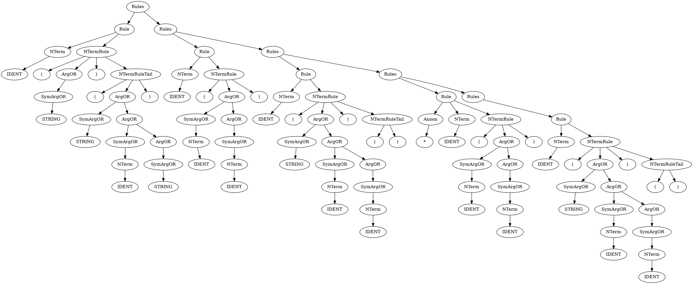

% Лабораторная работа № 2.3 «Синтаксический анализатор на основе
  предсказывающего анализа»
% 15 апреля 2024 г.
% Илья Алёшин, ИУ9-61Б

# Цель работы
Целью данной работы является изучение алгоритма построения таблиц предсказывающего анализатора.

# Индивидуальный вариант
```
/* аксиома помечена звёздочкой */
  F  ("n") ("(" E ")")
  T  (F T')
  T' ("*" F T') ()
* E  (T E')
  E' ("+" T E') ()
```

# Реализация

## Неформальное описание синтаксиса входного языка
Язык состоит из перечисление праил, и игнорируемых комментариев. 
Правило может быть как для аксиомы, помеченной звездой, так и для обычного нетерминала. 
Правая часть правила описывается перечислением выражений в круглых скобках. 
Например пустой символ представляется в виде '()'.

## Лексическая структура
Идентификаторы - это нетерминалы в грамматике
IDENT: [A-Z][A-Za-z]*\'*
Комментарии - это строки, обернутые в /* */
COMMENT: /*[^(*/)]*/
Строки - это терминалы в грамматике
STRING: \"[^\"]\"

Cтруктура описана в файле lexer.flex.

## Грамматика языка
Rules -> Rule Rules | EPSILON
Rule -> Axiom NTerm NTermRule
Axiom -> * | EPSILON
NTerm -> id
NTermRule -> ( ArgOR ) NTermRuleTail
NTermRuleTail -> ( ArgOR ) | EPSILON
ArgOR -> SymArgOR ArgOR | EPSILON
SymArgOR -> str | NTerm

## Программная реализация

Файл main.cpp:
```cpp
#include <iostream>
#include <cstdlib>
#include <string>
#include <fstream>
#include <memory>
#include <vector>

#include "scanner.hpp"
#include "token.hpp"
#include "position.hpp"
#include "parser.hpp"

using namespace std;

int main(const int argc, const char **argv)
{

   ifstream cin("/home/ilya/projects/bmstu/compilers/lab8/input.txt");
   Scanner scanner(&cin, &cout);

   shared_ptr<Token> lval = make_shared<Token>();
   shared_ptr<location_type> frag = make_shared<location_type>();

   DOMAIN_TAG tag;
   vector<Token> tokens;
   do
   {
      tag = scanner.lex(lval, frag);
      tokens.push_back(*lval);
      cout << lval->tag << "=" << lval->attr << ":" << lval->frag << endl;
   } while (tag != DOMAIN_TAG::TAG_END);

   Parser p(tokens);
   shared_ptr<Node> root = p.parse();

   root->print(0);

   ofstream out("/home/ilya/projects/bmstu/compilers/lab8/tree.dot");
   root->printDOT(out);

   cout << endl;
   return 0;
}

```

Файл scanner.hpp:
```cpp
#pragma once

#if !defined(yyFlexLexerOnce)
#include <FlexLexer.h>
#endif

#include <string>
#include <variant>
#include <memory>
#include <functional>

#include "position.hpp"
#include "token.hpp"

using return_type = DOMAIN_TAG;
using semantic_type = Token;
using location_type = Fragment;

class Scanner : public yyFlexLexer
{
public:
    Scanner(std::istream *in, std::ostream *out) : yyFlexLexer(in, out){};
    virtual ~Scanner(){};

    using FlexLexer::yylex;

    return_type lex(std::shared_ptr<Token> &lval, std::shared_ptr<location_type> &lloc);
};

class Driver
{
public:
    void common(const std::shared_ptr<Token> &lval,
                const std::shared_ptr<location_type> &lloc,
                const std::string &text);

    return_type end(const std::shared_ptr<Token> &lval);

public:
    std::string prev_text;
    std::string cur_text;

    Position prev_pos;
    Position cur_pos;
    bool continued = false;
};

```

Файл scanner.cpp:
```cpp
#include "scanner.hpp"

#include <iostream>

void Driver::common(const std::shared_ptr<Token> &lval,
                    const std::shared_ptr<location_type> &lloc,
                    const std::string &text)
{
    if (!continued)
    {
        lloc->start = cur_pos;
        cur_text.clear();
    }
    continued = false;

    // prev_text = cur_text;
    // prev_pos = cur_pos;

    cur_text += text;
    for (size_t i = 0; i < text.size(); ++i)
    {
        cur_pos++;
        if (text[i] == '\n')
        {
            cur_pos.new_line();
        }
    }
    lloc->end = cur_pos;

    lval->frag = *lloc;
    lval->attr = cur_text;
}

return_type Driver::end(const std::shared_ptr<Token> &lval)
{
    lval->attr.clear();
    lval->tag = DOMAIN_TAG::TAG_END;
    return lval->tag;
}

```

Файл token.hpp:
```cpp
#pragma once

#include "position.hpp"

#include <unordered_map>

enum DOMAIN_TAG
{
    TAG_IDENT,
    TAG_STRING,
    TAG_STAR,
    TAG_LPAREN,
    TAG_RPAREN,

    TAG_COMMENT,
    TAG_WHITESPACE,
    TAG_ERROR,
    TAG_EMPTY,

    TAG_END
};

struct Token
{
    DOMAIN_TAG tag;
    Fragment frag;
    std::string attr;

    static std::unordered_map<DOMAIN_TAG, std::string> tag2string;
};

std::ostream &operator<<(std::ostream &out, const Token &token);

```
Файл token.cpp:
```cpp
#include "token.hpp"

std::unordered_map<DOMAIN_TAG, std::string> Token::tag2string = {
    {TAG_IDENT, "IDENT"},
    {TAG_STRING, "STRING"},
    {TAG_STAR, "*"},
    {TAG_LPAREN, "("},
    {TAG_RPAREN, ")"},
    {TAG_END, "EOF"},
};

std::ostream &operator<<(std::ostream &out, const Token &token)
{
    out << token.tag2string.at(token.tag) << ":" << token.frag;
    return out;
}

```


Файл parser.hpp:
```cpp
#pragma once

#include "token.hpp"
#include "node.hpp"

#include <vector>
#include <memory>
#include <unordered_map>

struct ParseNode
{
  TagORNTerm tagnterm;
  std::shared_ptr<NTermNode> node;
};

class Parser
{
public:
  Parser(const std::vector<Token> &tokens);

  std::shared_ptr<Node> parse();

private:
  std::vector<Token> tokens;
  const std::vector<std::vector<TagORNTerm>> rules{
      {Rule, Rules},
      {},
      {Axiom, NTerm, NTermRule},
      {TAG_STAR},
      {},
      {TAG_IDENT},
      {TAG_LPAREN, ArgOR, TAG_RPAREN, NTermRuleTail},
      {TAG_LPAREN, ArgOR, TAG_RPAREN},
      {},
      {SymArgOR, ArgOR},
      {},
      {TAG_STRING},
      {NTerm},
  };
  std::unordered_map<NON_TERM, std::unordered_map<DOMAIN_TAG, std::vector<TagORNTerm>>> table{
      {Rules,
       {{TAG_IDENT, rules[0]},
        {TAG_STAR, rules[0]},
        {TAG_END, rules[1]}}},
      {Rule,
       {{TAG_IDENT, rules[2]},
        {TAG_STAR, rules[2]}}},
      {Axiom,
       {{TAG_IDENT, rules[4]},
        {TAG_STAR, rules[3]}}},
      {NTerm,
       {{TAG_IDENT, rules[5]}}},
      {NTermRule,
       {{TAG_LPAREN, rules[6]}}},
      {NTermRuleTail,
       {{TAG_IDENT, rules[8]},
        {TAG_STAR, rules[8]},
        {TAG_LPAREN, rules[7]},
        {TAG_END, rules[8]}}},
      {ArgOR,
       {{TAG_IDENT, rules[9]},
        {TAG_STRING, rules[9]},
        {TAG_RPAREN, rules[10]}}},
      {SymArgOR,
       {{TAG_IDENT, rules[12]},
        {TAG_STRING, rules[11]}}}};
};

```


Файл parser.cpp:
```cpp
#include "parser.hpp"
#include "node.hpp"
#include "token.hpp"

#include <tuple>
#include <stack>

Parser::Parser(const std::vector<Token> &tokens)
{
    this->tokens = tokens;
}

std::shared_ptr<Node> Parser::parse()
{
    std::stack<ParseNode> stack;
    stack.push({DOMAIN_TAG::TAG_END, nullptr});

    auto root = std::make_shared<NTermNode>(NON_TERM::ROOT);
    stack.push({NON_TERM::Rules, root});

    int token_ind = 0;
    while (!stack.empty()) {
        ParseNode cur = stack.top();
        stack.pop();

        if (cur.tagnterm.is_tag) {
            if (cur.tagnterm.tag == tokens[token_ind].tag) {
                if (cur.tagnterm.tag != DOMAIN_TAG::TAG_END) {
                    auto new_child = std::make_shared<LeafNode>(tokens[token_ind]);
                    cur.node->children.push_back(new_child);
                }
                token_ind++;
            } else {
                throw std::runtime_error(
                    "wrong tag: \n\treceived:" + Token::tag2string[tokens[token_ind].tag] + "\n\texpected:" +
                    Token::tag2string[cur.tagnterm.tag]);
            }
        } else {
            std::vector<TagORNTerm> next_rule = table[cur.tagnterm.nterm][tokens[token_ind].tag];
            if (next_rule.size() > 0) {
                auto new_parent = std::make_shared<NTermNode>(cur.tagnterm.nterm);
                cur.node->children.push_back(new_parent);
                for (int i = next_rule.size() - 1; i >= 0; i--) {
                    stack.push({next_rule[i], new_parent});
                }
            }
        }
    }
    return root->children[0];
}

```


Файл node.hpp:
```cpp
#pragma once

#include "token.hpp"

#include <vector>
#include <memory>
#include <unordered_map>

enum NON_TERM : int
{
    Rules,
    Rule,
    Axiom,
    NTerm,
    NTermRule,
    NTermRuleTail,
    ArgOR,
    SymArgOR,

    ROOT,
};

struct TagORNTerm
{
    DOMAIN_TAG tag;
    NON_TERM nterm;
    bool is_tag;

    TagORNTerm(DOMAIN_TAG tag);
    TagORNTerm(NON_TERM nterm);
};

struct Node
{
    virtual void print(int s) = 0;

    void printDOT(std::ostream &out);

    virtual void printDOT_(std::ostream &out_filename, int &n) = 0;
};

struct NTermNode : public Node
{
    NTermNode(NON_TERM nterm);

    void print(int s) override;
    // void printDOT(std::ostream &out) override;

    void printDOT_(std::ostream &out_filename, int &n) override;

public:
    NON_TERM nterm;
    std::vector<std::shared_ptr<Node>> children;

    static std::unordered_map<NON_TERM, std::string> nterm2string;
};

struct LeafNode : public Node
{
    LeafNode(const Token &token);

    void print(int s) override;
    // void printDOT(std::ostream &out) override;

    void printDOT_(std::ostream &out_filename, int &n) override;

public:
    Token token;
};

```


Файл node.cpp:
```cpp
#include "node.hpp"

TagORNTerm::TagORNTerm(DOMAIN_TAG tag)
{
    this->tag = tag;
    is_tag = true;
}

TagORNTerm::TagORNTerm(NON_TERM nterm)
{
    this->nterm = nterm;
    is_tag = false;
}

NTermNode::NTermNode(NON_TERM nterm) : nterm(nterm) {}

std::unordered_map<NON_TERM, std::string> NTermNode::nterm2string = {
    {Rules, "Rules"},
    {Rule, "Rule"},
    {Axiom, "Axiom"},
    {NTerm, "NTerm"},
    {NTermRule, "NTermRule"},
    {NTermRuleTail, "NTermRuleTail"},
    {ArgOR, "ArgOR"},
    {SymArgOR, "SymArgOR"},
    {ROOT, "ROOT"},
};

LeafNode::LeafNode(const Token &token) : token(token) {}

//===============================  DOT

void Node::printDOT(std::ostream &out) {
    out << "digraph G {" << std::endl;
    int n = 0;
    printDOT_(out, n);
    out << "}" << std::endl;    
}

void NTermNode::printDOT_(std::ostream &out, int &n)
{
    out << n << " [label=\"" << nterm2string[nterm] << "\"]" << std::endl;
    int parent = n;
    std::vector<int> children_nums;
    for (size_t i = 0; i < children.size(); ++i)
    {
        n++;
        out << parent << "->" << n << std::endl;
        children_nums.push_back(n);
        children[i]->printDOT_(out, n);
    }

    if (children_nums.size() > 1)
    {
        out << "{ rank=same; ";
        out << children_nums[0];
        for (size_t i = 1; i < children_nums.size(); ++i)
        {
            out << " -> " << children_nums[i];
        }
        out << " [style=invis] }" << std::endl;
    }
}

void LeafNode::printDOT_(std::ostream &out, int &n)
{
    out << n << " [label=\"" << token.tag2string[token.tag] << "\"]" << std::endl;
}

//===============================  print

void NTermNode::print(int s)
{
    for (int i = 0; i < s; ++i)
    {
        std::cout << "------";
    }
    std::cout << nterm2string[nterm] << std::endl;
    for (size_t i = 0; i < children.size(); ++i)
    {
        children[i]->print(s + 1);
    }
}

void LeafNode::print(int s)
{
    for (int i = 0; i < s; ++i)
    {
        std::cout << "------";
    }
    std::cout << token << " " << std::endl;
}

```


Файл position.hpp:
```cpp
#pragma once

#include <iostream>

struct Position
{
    int line = 1;
    int pos = 1;
    int index = 1;

    void operator++(int);
    void new_line();
};

std::ostream &operator<<(std::ostream &out, const Position &pos);

struct Fragment
{
    Position start;
    Position end;
};

std::ostream &operator<<(std::ostream &out, const Fragment &frag);

```
Файл position.cpp:
```cpp
#include "position.hpp"

std::ostream &operator<<(std::ostream &out, const Position &pos)
{
    out << "(" << pos.line << "," << pos.pos << ")";
    return out;
}

void Position::operator++(int) {
    index++;
    pos++;
}

void Position::new_line() {
    pos = 1;
    line++;
}


std::ostream &operator<<(std::ostream &out, const Fragment &frag)
{
    out << frag.start << "-" << frag.end;
    return (out);
}

```

Файл lexer.flex:
```lex
%{
/* C++ string header, for string ops below */
#include <string>
#include <iostream>
#include <memory>

#include "scanner.hpp"
#include "token.hpp"

/* Implementation of yyFlexScanner */ 
#undef  YY_DECL
#define YY_DECL \
 return_type Scanner::lex(std::shared_ptr<semantic_type>& lval, std::shared_ptr<location_type>& lloc)

#define yyterminate() return (driver.end(lval))

Driver driver;

#define YY_USER_ACTION \ 
{ \
   driver.common(lval, lloc, yytext); \
}

%}

%option debug
%option nodefault
%option yyclass="Scanner"
%option noyywrap
%option c++


IDENT [A-Z][A-Za-z]*\'*

%x COMMENT STRING

%%

{IDENT} {
   lval->tag = DOMAIN_TAG::TAG_IDENT;
   return lval->tag;
}

\/\* {
   BEGIN(COMMENT);
   driver.continued = true;
}

<COMMENT>. {
   driver.continued = true;
}

<COMMENT>\*\/ {
   BEGIN(INITIAL);
   // lval->tag = DOMAIN_TAG::TAG_COMMENT;
   // return lval->tag;
}

<COMMENT><<EOF>> {
   std::cout << "error in comment!" << std::endl;
   // lval->tag = DOMAIN_TAG::TAG_END;
   return driver.end(lval);
}

\" {
   BEGIN(STRING);
   driver.continued = true;
}

<STRING>\" {
   BEGIN(0);
   lval->tag = DOMAIN_TAG::TAG_STRING;
   return lval->tag;
}

<STRING>\n |

<STRING><<EOF>> {
   throw std::runtime_error("error in token STRING:\n\treceived:EOF\n\texpected:\"");
   // lval->tag = DOMAIN_TAG::TAG_END;
   // return lval->tag;
}

<STRING>. {
   driver.continued = true;
}

\( {
   lval->tag = DOMAIN_TAG::TAG_LPAREN;
   return lval->tag;
}

\) {
   lval->tag = DOMAIN_TAG::TAG_RPAREN;
   return lval->tag;
}

\* {
   lval->tag = DOMAIN_TAG::TAG_STAR;
   return lval->tag;
}

[ \t\r\n]+ {
   // lval->tag = DOMAIN_TAG::TAG_WHITESPACE;
   // return lval->tag;
}

. {
   throw std::runtime_error("error token:\n\treceived:"+lval->attr);
   // lval->tag = DOMAIN_TAG::TAG_ERROR;
   // return lval->tag;
}


%%

```

# Тестирование

Входные данные

```
/* аксиома помечена звёздочкой */
  F  ("n") ("(" E ")")
  T  (F T')
  T' ("*" F T') ()
* E  (T E')
  E' ("+" T E') ()
```

Вывод на `stdout`



# Вывод
В данной лабораторной работе изучил возможности генератора лексических анализаторов flex и его C++ api. 
Узнал, что такое предсказывающий анализ и как его реализовывать.
Вспомнил, как вручную строить множества First и Follow и выписывать по ним таблицу предсказывающего анализа.
Также узнал, как строить дерево синтаксического разбора обычным спуском с использованием стека.
